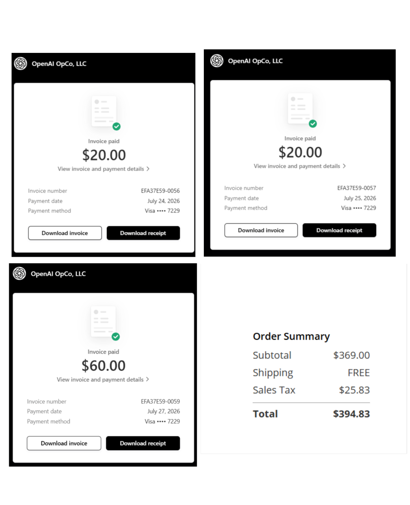
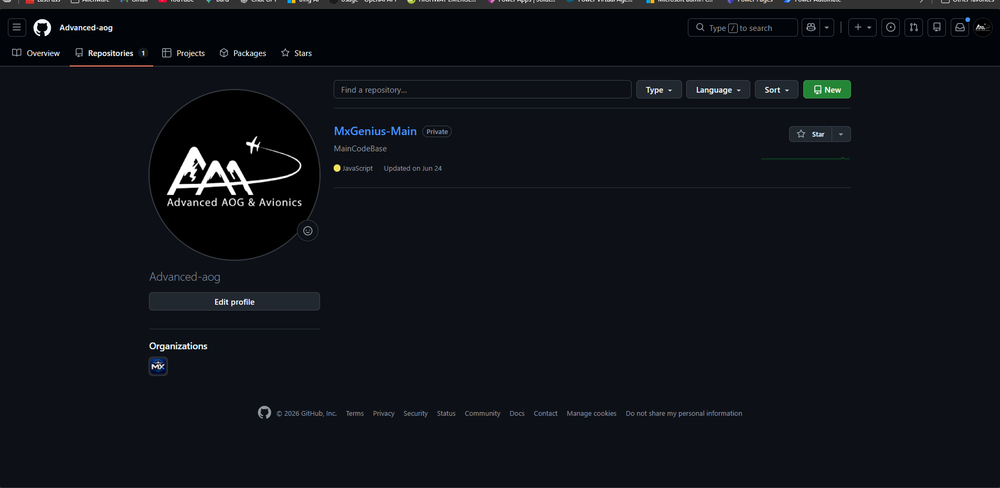
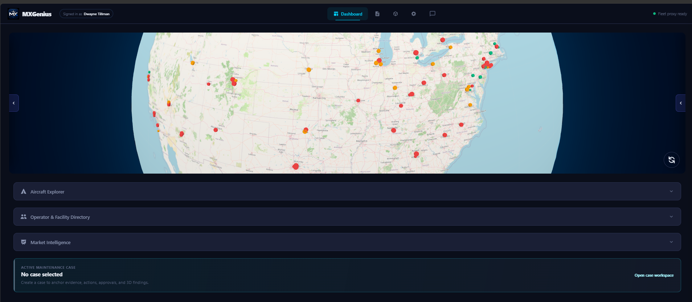
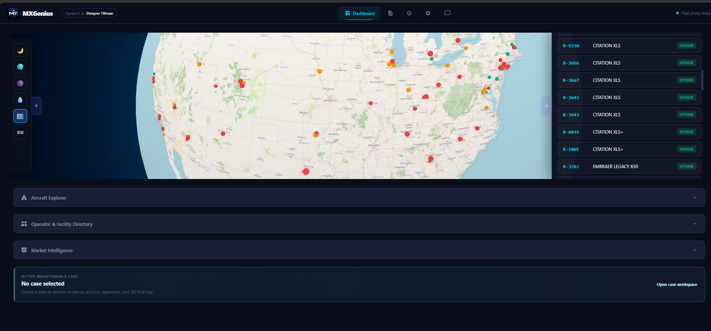
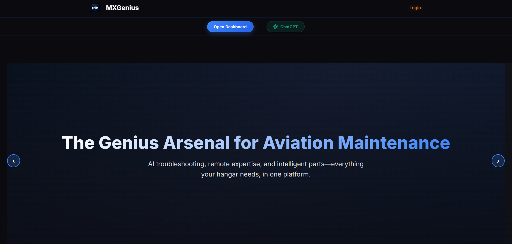

# Weekly Progress Report — Week 19
**Date Range:** Jul 20, 2026 — Jul 26, 2026
**Project:** Advanced AOG · Hermetic Labs

---

## Expenses this month

*Total= $494.83*

## Back end clean-up and service

*The back end is now clean without the competing repos. The main source code lives at advancedAOG. Everything else lives at MX Genius. There's no longer a tracker that lives by itself. The tracker now lives inside of settings in the MX Genius app.*

## map expansion

*Added an additional layer that gives you more details for roads, airport names, general map information for quality.*

## side panels

*The map has also been normalized to a smooth left and right layout, with left being the map filters and VR, and right being the details that you click on.*

## Rocky update

*This is more catching Josh up, but me and Rocky have been going back and forth, leaning out the back end for the legal stuff and the aesthetics just for the landing page. I think he looped you in on one of those emails, but we've been chugging along at that.*

## settings update

*Okay, so there's actually a lot going on here. I'm still wiring it up, but you should be able to change your profile picture. We're gonna have that save on the server. The operations is the skills that the model actually have. Appearance is obvious, it changes the color scheme. The tracker is found right there, second to bottom card, just over beta access. And beta access is how you add additional people to the closed beta.*

## 3d Viewer update

*We now have the ability to upload custom 3D models and have the viewer read whatever the parts are. So it doesn't matter where the model comes from. We have it connected to a NASA API just to pull different specs from things. I'm gonna mature that in the upcoming month just so we have some options to play with. But as of now, the direction is gonna be mesh agnostic, and I'm gonna try to get as many readable capabilities in there as I can.*

## cases

*The case system is online, though I'm still working the bugs out of it. It has an approval system that you can have in chat. I'll keep you updated on it, but it is live.*

## Hold our beer!

🎬 **Video:** Recording 2026-07-27 062935.mp4
*You won't be able to hear me speaking in this, but this is real time. And it is something I've never seen before. And I challenge you to speak to any model that you know of in real time and have it produce actual tool calls at the same time. I've never seen it. I had to create a weird kind of flow to make it work, but play with it. We're still working on model output. We do have structured output. In the backend, I'm just layering it in. I'll leave image confirmation.*

## structured output buttons

*This is still pretty new, so you'll have to press one of these buttons and then manually open the chat. In the next update, it'll do it automatically, but this is how you activate structured output.*

## maintenance case deep-dive

*The maintenance case system is now live with full evidence tracing. You can see the discrepancy, timeline, technical sources (e.g. Chapter 29 Hydraulic Power), evidence chain from manuals, warnings, and a capability trace at the bottom. The approval workflow is wired up — cases come in as "pending" and can be reviewed right in the tool.*

## landing page refresh

*The landing page got a fresh coat of paint. "The Genius Arsenal for Aviation Maintenance" — AI troubleshooting, remote expertise, and intelligent parts, all in one platform. Clean hero, Open Dashboard and ChatGPT entry points front and center.*

## dashboard active cases

*Dashboard now surfaces active maintenance cases right below the globe, Aircraft Explorer, Operator & Facility Directory, and Market Intelligence. If there's an open case (like N30JE here), it shows up with a green accent and an "Open case workspace" link so you never miss an active AOG situation.*

## AI triage advisory

*This is the MxGenius AI chat producing a full AOG Issue Triage — a Non-Authoritative Starting Checklist for a Challenger 604. It lays out "Verify First" steps, leading historical patterns, what worked in retrieved records, labor-by-action breakdown with hour estimates, and clearly states its limitations. This is structured output from the model, not a wall of text.*

## aircraft detail panel

*Clicking into an aircraft now gives you a full spec sheet — photos, gallery, tail number (N220LC), Challenger 601-3A identification, base location (Teterboro/KTEB), airframe hours, APU details, maintenance program, and the MxGenius AI Chat shortcut buttons (Maintenance schedule, Common AOG issues, Inspection intervals, Engine overhaul). Everything in one place.*

## the full picture

*Side-by-side view showing the aircraft detail panel and the AI triage advisory together. This is what the workflow looks like when everything connects — you pull up an aircraft, hit one of the AI chat buttons, and get a full triage breakdown right next to the spec sheet. That's the vision coming together.*

## Next>>>

We've done quite a lot this month, wrapping up AR, VR integration, cloud migration, and a skill list and performance that any company can be proud of. I plan on maturing and hardening what we have, and taking any feedback that you guys might have. Other than that, I'll be heads down in development. This is a very slow process. Modeling is slow, 3D printers are slow, engineering is slow, but I'll be available throughout the process. I'm guessing maybe should have a prototype in hand, if all things go well, by the end of August. Fingers crossed. I'll keep you updated if that changes.

---

*Prepared by Hermetic Labs for Advanced AOG*
