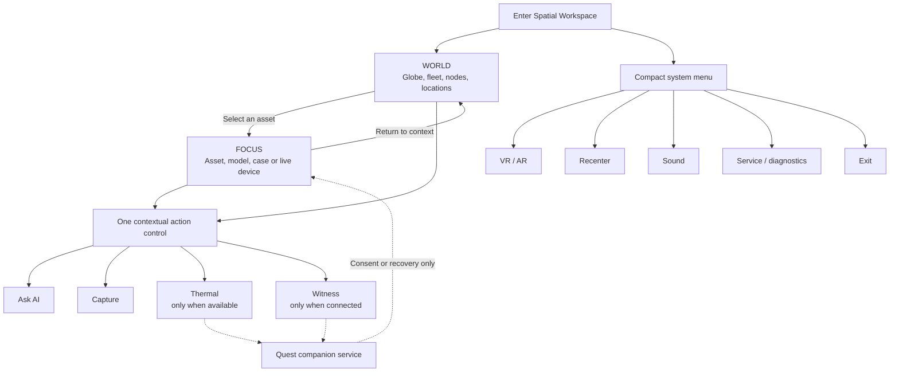

# XR spatial workspace direction

Decision locked: **September 27, 2026**

The headset experience is one Spatial Workspace with two contextual views. World
contains the globe, fleet, nodes, and locations. Selecting something moves the
user into Focus without discarding context. Focus contains the selected asset,
model, case, or live device.

Tools are capabilities, not destinations. One contextual action control exposes
AI, Capture, Thermal, and Witness only when each capability is relevant. VR/AR,
recenter, sound, service diagnostics, and exit belong in a separate compact
system menu. The native Quest companion operates as a background service and
surfaces only for consent, configuration, or recovery.

## Interaction rules

- At rest, show the environment or object and one small summonable affordance.
- Open at most one contextual card or tool window at a time.
- Do not treat World, Focus, VR, AR, Thermal, Witness, AI, or Capture as separate
  user-facing scenes.
- Nothing follows the wearer's head except a deliberately summoned control; it
  fades or docks after use.
- Keep setup, traces, and diagnostics behind Service unless recovery is required.
- Preserve selected-object and case context when moving between World and Focus.
